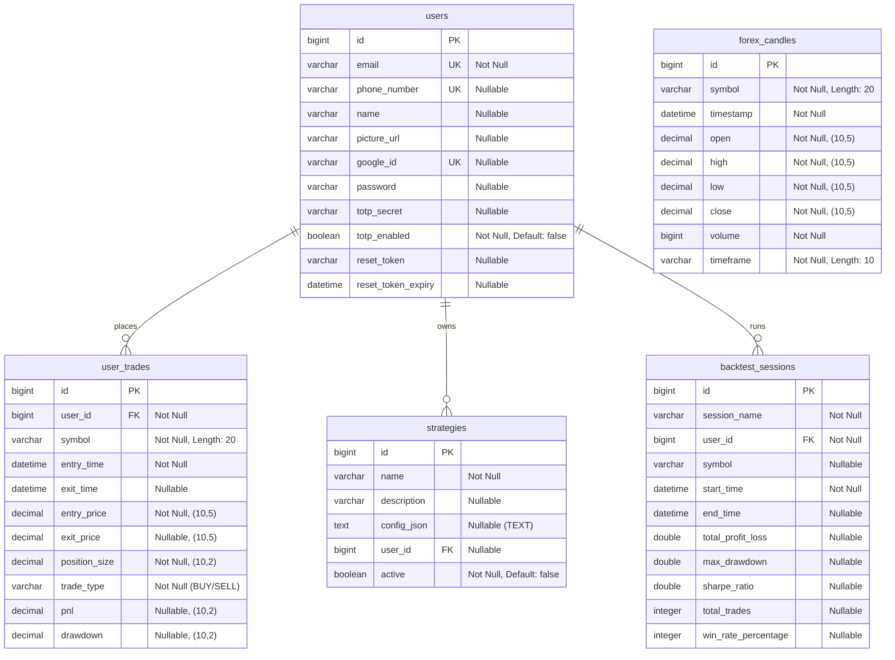

# ForexQuant Pro — Entity-Relationship (ER) Diagram

This document contains the Entity-Relationship (ER) diagram and database schema details for the ForexQuant Pro platform. The system uses a clean relational structure to manage users, trades, strategies, backtests, and high-performance market data.

---

## ER Diagram (Mermaid)

Below is the visual database representation including keys, indexes, and tables relationships.

---

## Detailed Schema Documentation

### 1. `users` Table
Stores authentication data, profile details, and MFA credentials.
* **Primary Key:** `id` (bigint)
* **Unique Constraints:** `email`, `phone_number`, `google_id`

| Column | Type | Nullable | Description |
| :--- | :--- | :---: | :--- |
| `id` | `bigint` | No | Auto-increment primary key. |
| `email` | `varchar` | No | User's unique email address. |
| `phone_number` | `varchar` | Yes | Unique phone number for OTP verification. |
| `name` | `varchar` | Yes | Name of the user. |
| `picture_url` | `varchar` | Yes | URL to the Google account/profile picture. |
| `google_id` | `varchar` | Yes | OAuth unique identifier for Google Login. |
| `password` | `varchar` | Yes | Encrypted password (null for pure OAuth users). |
| `totp_secret` | `varchar` | Yes | Base32 secret for dual-layer authentication (2FA). |
| `totp_enabled` | `boolean` | No | Flag indicating if MFA/TOTP security is enabled (Default: false). |
| `reset_token` | `varchar` | Yes | Token used for password recovery. |
| `reset_token_expiry`| `datetime`| Yes | Expiration time of password recovery token. |

---

### 2. `user_trades` Table
Tracks trading execution metrics for live or demo accounts.
* **Primary Key:** `id` (bigint)
* **Logical Foreign Key:** `user_id` maps to `users.id`

| Column | Type | Nullable | Description |
| :--- | :--- | :---: | :--- |
| `id` | `bigint` | No | Auto-increment primary key. |
| `user_id` | `bigint` | No | Logical link to the user who placed the trade. |
| `symbol` | `varchar(20)`| No | Currency pair traded (e.g., `EUR/USD`, `GBP/JPY`). |
| `entry_time` | `datetime` | No | Date & time when the trade was entered. |
| `exit_time` | `datetime` | Yes | Date & time when the trade was closed. |
| `entry_price` | `decimal(10,5)`| No | Asset price at entry. |
| `exit_price` | `decimal(10,5)`| Yes | Asset price at exit. |
| `position_size` | `decimal(10,2)`| No | Volume/Lot size of the order. |
| `trade_type` | `varchar` | No | Enum constraint: `BUY` or `SELL`. |
| `pnl` | `decimal(10,2)`| Yes | Profit and Loss realized from the trade. |
| `drawdown` | `decimal(10,2)`| Yes | Max drawdown experienced during the trade. |

---

### 3. `strategies` Table
Stores custom automated trading strategies created or customized by users.
* **Primary Key:** `id` (bigint)
* **Logical Foreign Key:** `user_id` maps to `users.id`

| Column | Type | Nullable | Description |
| :--- | :--- | :---: | :--- |
| `id` | `bigint` | No | Auto-increment primary key. |
| `name` | `varchar` | No | Strategy name (e.g., `MACD Crossover`, `RSI Mean Reversion`). |
| `description` | `varchar` | Yes | Brief description of the logic. |
| `config_json` | `text` | Yes | Strategy parameters stored as JSON configurations. |
| `user_id` | `bigint` | Yes | Logical link to creator (null for platform defaults). |
| `active` | `boolean` | No | Toggle to enable/disable automated running state. |

---

### 4. `backtest_sessions` Table
Caches analytical data of strategies simulated on historical price feeds.
* **Primary Key:** `id` (bigint)
* **Logical Foreign Key:** `user_id` maps to `users.id`

| Column | Type | Nullable | Description |
| :--- | :--- | :---: | :--- |
| `id` | `bigint` | No | Auto-increment primary key. |
| `session_name` | `varchar` | No | Name for this backtest simulation. |
| `user_id` | `bigint` | No | Logical link to the user who performed the simulation. |
| `symbol` | `varchar` | Yes | Currency pair backtested. |
| `start_time` | `datetime` | No | Historical starting point. |
| `end_time` | `datetime` | Yes | Historical ending point. |
| `total_profit_loss`| `double` | Yes | Cumulative PnL metric. |
| `max_drawdown` | `double` | Yes | Peak-to-trough decline percentage. |
| `sharpe_ratio` | `double` | Yes | Risk-adjusted return ratio. |
| `total_trades` | `integer` | Yes | Number of trades executed in the backtest. |
| `win_rate_percentage`| `integer`| Yes | Percentage of profitable trades. |

---

### 5. `forex_candles` Table
High-performance lookup table storing historical price candles for charting and strategy testing.
* **Primary Key:** `id` (bigint)
* **Indexes:** `idx_symbol_time` on `(symbol, timestamp)` for fast historical queries.

| Column | Type | Nullable | Description |
| :--- | :--- | :---: | :--- |
| `id` | `bigint` | No | Auto-increment primary key. |
| `symbol` | `varchar(20)`| No | Currency pair name (e.g., `EUR/USD`). |
| `timestamp` | `datetime` | No | Timestamp of the candle. |
| `open` | `decimal(10,5)`| No | Opening price. |
| `high` | `decimal(10,5)`| No | High price. |
| `low` | `decimal(10,5)`| No | Low price. |
| `close` | `decimal(10,5)`| No | Closing price. |
| `volume` | `bigint` | No | Volume traded during timeframe. |
| `timeframe` | `varchar(10)`| No | Resolution interval (e.g., `1m`, `5m`, `1h`, `1d`). |
